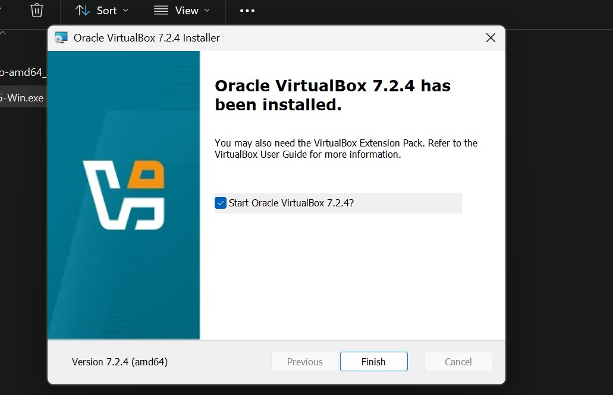
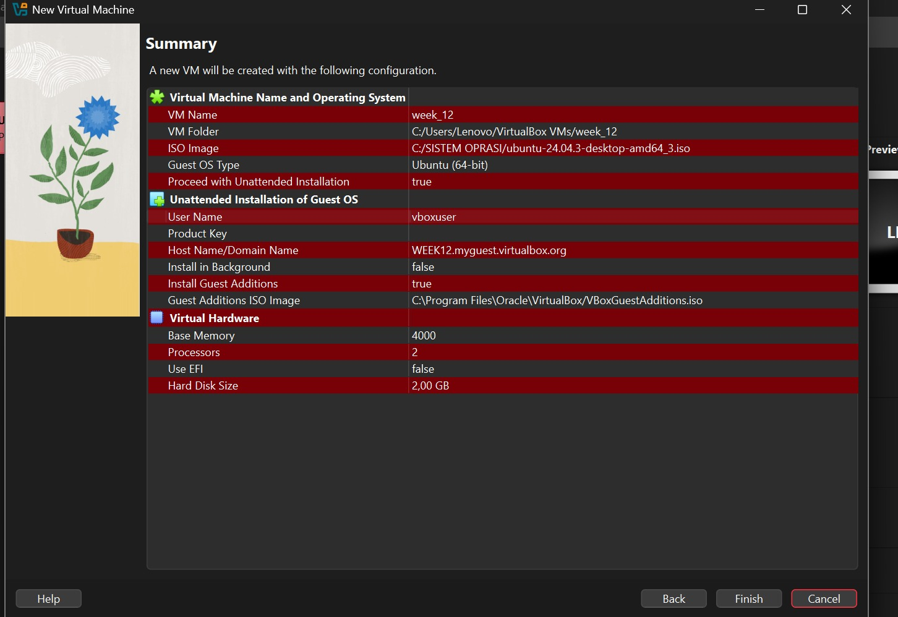
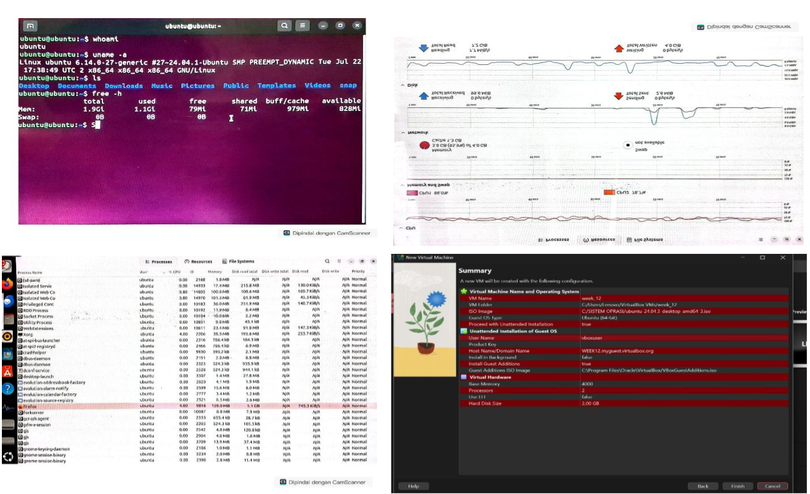
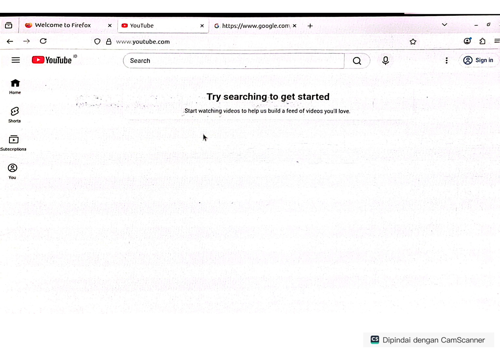

# Laporan Praktikum Minggu [12]
Topik:  Virtualisasi Menggunakan Virtual Machine

---

## Identitas
- **Nama & NIM**  
- Ilham Dzufikar Barokah (250202942)
- Asyifani Lutfiana Nadzif (250202931)
- **Kelas** : 1IKRB

---

## Tujuan
Tuliskan tujuan praktikum minggu ini.  
1. Menginstal perangkat lunak virtualisasi (VirtualBox/VMware).  
2. Membuat dan menjalankan sistem operasi guest di dalam VM.  
3. Mengatur konfigurasi resource VM (CPU, RAM, storage).  
4. Menjelaskan mekanisme proteksi OS melalui virtualisasi.  
5. Menyusun laporan praktikum instalasi dan konfigurasi VM secara sistematis.

---

## Dasar Teori
1. Pengertian Virtual Machine

Virtual Machine (VM) adalah komputer virtual yang berjalan di dalam komputer fisik (host). VM bekerja seolah-olah seperti komputer sungguhan karena memiliki sistem operasi, CPU, RAM, dan storage sendiri, tetapi semua itu sebenarnya dibagi dari sumber daya komputer utama melalui sebuah perangkat lunak yang disebut hypervisor. Dengan VM, satu komputer fisik dapat menjalankan beberapa sistem operasi secara bersamaan, misalnya Windows dan Linux dalam satu perangkat.
2. Konsep Dasar Virtualisasi
Virtualisasi adalah teknologi yang memungkinkan pemisahan antara perangkat keras fisik dan sistem operasi. Hypervisor bertugas mengatur pembagian sumber daya seperti:
- Prosesor (CPU)
- Memori (RAM)
- Penyimpanan (Storage)
- Jaringan (Network)
Setiap VM berjalan terisolasi, sehingga gangguan pada satu VM tidak memengaruhi VM lain atau sistem host.
3. Komponen Utama Virtual Machine
Beberapa komponen penting dalam penggunaan VM adalah:
- Host Machine: Komputer fisik utama.
- Guest Operating System: Sistem operasi yang berjalan di dalam VM.
- Hypervisor: Perangkat lunak pengelola VM (contoh: VirtualBox, VMware, Hyper-V).
- Virtual Hardware: Perangkat keras virtual seperti CPU, RAM, dan hard disk virtual.
---

## Langkah Praktikum
1. **Instalasi Virtual Machine**
   - Instal VirtualBox atau VMware pada komputer host.  
   - Pastikan fitur virtualisasi (VT-x / AMD-V) aktif di BIOS.

2. **Pembuatan OS Guest**
   - Buat VM baru dan pilih OS guest (misal: Ubuntu Linux).  
   - Atur resource awal:
     - CPU: 1–2 core  
     - RAM: 2–4 GB  
     - Storage: ≥ 20 GB

3. **Instalasi Sistem Operasi**
   - Jalankan proses instalasi OS guest sampai selesai.  
   - Pastikan OS guest dapat login dan berjalan normal.

4. **Konfigurasi Resource**
   - Ubah konfigurasi CPU dan RAM.  
   - Amati perbedaan performa sebelum dan sesudah perubahan resource.

5. **Analisis Proteksi OS**
   - Jelaskan bagaimana VM menyediakan isolasi antara host dan guest.  
   - Kaitkan dengan konsep *sandboxing* dan *hardening* OS.

6. **Dokumentasi**
   - Ambil screenshot setiap tahap penting.  
   - Simpan di folder `screenshots/`.

7. **Commit & Push**
    ```bash
   git add .
   git commit -m "Minggu 12 - Virtual Machine"
   git push origin main
   ```
---

## Kode / Perintah
Tuliskan potongan kode atau perintah utama:
```bash
# Mengecek user yang sedang aktif
whoami
# Menampilkan informasi detail kernel dan arsitektur sistem
uname -a
# Menampilkan daftar file di direktori saat ini
ls
# Mengecek penggunaan Memori (RAM) 
free -h
```
---

## Hasil Eksekusi
Sertakan screenshot hasil percobaan atau diagram:
1. Persiapan instalasi proses menginstal oracle vistual box untuk persiapan dalam pembuatan virtual/machine 

2. Konfigurasi & instalasi VM proses pembuatan mesin virtual menggunakan fitur unattended install di virtual box untuk otomatisasi instalasi Ubuntu

3. Eksperimen VM linux ubuntu 24. pengecekan menggunkan perintah `uname-a` (cek karnel) & `free -h`(cek RAM).
   Terlihat total RAM terbaca adalah 3.8Gi (4GB).
   Pengujian beban kerja dengan membuka 4 tab Firefox (YouTube dan E-learning).
- Hasil: RAM terpakai mencapai 95.9% (3.8 GB).
- Kondisi: Sistem masih berjalan responsif dan lancar meskipun penggunaan memori hampir penuh.

4. Setelah proses mengurangi Resource , kemudian membuka lagi VM dan membuka system manager, terlihat belum menjalankan aplikasi lain sudah memakan RAM 2.0 GB (97.7% ).

Saat menggunakan RAM 4GB, membuka 5 tab berjalan lancar meski RAM terpakai 90%. Namun, saat RAM diturunkan menjadi 2GB, sistem menjadi sangat lambat (lag) dan Firefox sering not responding karena kehabisan memori.


---

## Analisis
1. Pengaruh Alokasi Resource terhadap Performa
Hasil praktikum menunjukkan bahwa alokasi RAM sangat berpengaruh terhadap kinerja VM. Dengan RAM 4 GB, Ubuntu masih berjalan lancar meskipun penggunaan memori mencapai lebih dari 90%, sedangkan pada RAM 2 GB sistem menjadi lambat dan aplikasi sering not responding akibat keterbatasan memori.

2. Efektivitas Isolasi Virtual Machine
Virtual Machine berhasil menyediakan isolasi antara sistem host dan guest. Seluruh aktivitas dan gangguan yang terjadi di dalam VM, termasuk penggunaan resource tinggi dan crash aplikasi, tidak memengaruhi sistem host, sehingga membuktikan konsep sandboxing pada virtualisasi.

3. Pentingnya Perencanaan Konfigurasi VM
Praktikum ini membuktikan bahwa perencanaan konfigurasi resource yang tepat sangat penting dalam penggunaan VM. Alokasi resource yang sesuai kebutuhan akan menghasilkan sistem yang stabil dan responsif, sedangkan konfigurasi yang kurang optimal dapat menurunkan performa secara signifikan.

---

## Kesimpulan
. Virtual Machine memungkinkan satu komputer fisik menjalankan beberapa sistem operasi secara bersamaan dengan tingkat isolasi yang baik, sehingga OS guest dapat berjalan aman tanpa memengaruhi sistem host.

2. Performa Virtual Machine sangat dipengaruhi oleh alokasi resource, khususnya RAM. Alokasi yang cukup (4 GB) menghasilkan sistem yang stabil dan responsif, sedangkan alokasi yang rendah (2 GB) menyebabkan penurunan performa yang signifikan.


---

## Quiz
1. Apa perbedaan antara host OS dan guest OS?
   
- Host OS
Host Operating System (Host OS) adalah sistem operasi utama yang terpasang langsung pada komputer fisik. Host OS berfungsi mengelola perangkat keras seperti CPU, RAM, hard disk, dan perangkat I/O, serta menjadi tempat hypervisor dijalankan.
-  Guest OS
Guest Operating System (Guest OS) adalah sistem operasi yang berjalan di dalam Virtual Machine (VM). Guest OS tidak berinteraksi langsung dengan hardware fisik, melainkan melalui perangkat keras virtual yang disediakan oleh hypervisor.

2. Apa peran hypervisor dalam virtualisasi?
   
   Peran utama hypervisor adalah:

- Mengalokasikan sumber daya hardware
Hypervisor membagi CPU, RAM, storage, dan jaringan ke setiap VM sesuai kebutuhan, agar tidak saling berebut sumber daya.
- Mengelola dan mengisolasi VM
Setiap VM berjalan secara terpisah. Jika satu VM mengalami error atau crash, VM lain dan Host OS tidak ikut terganggu.
- Menyediakan hardware virtual
Hypervisor membuat perangkat keras virtual (virtual CPU, virtual disk, virtual network) yang digunakan oleh Guest OS seolah-olah itu adalah hardware asli.
- Mengatur eksekusi sistem operasi
Hypervisor memastikan instruksi dari Guest OS dapat dijalankan dengan aman di atas hardware fisik tanpa konflik.
- Menjaga keamanan sistem 
 Dengan isolasi yang kuat, hypervisor membantu mencegah akses langsung Guest OS ke hardware fisik atau ke VM lain.
   
3. Mengapa virtualisasi meningkatkan keamanan sistem?
   
- Virtualisasi meningkatkan keamanan karena setiap VM berjalan dalam lingkungan yang terisolasi (sandboxing). Jika terjadi kesalahan, serangan, atau malware pada satu VM, dampaknya tidak akan menyebar ke VM lain maupun ke sistem host. Selain itu, virtualisasi memudahkan penerapan pengujian, pembatasan akses, serta pemulihan sistem (snapshot), sehingga risiko kerusakan sistem dapat diminimalkan.
  

---

## Refleksi Diri
Tuliskan secara singkat:
- Apa bagian yang paling menantang minggu ini?  
> - Tidak bisa screenshot saat menjalankan aplikasi menjadikan menggunakan aplikasi tambahan (difoto menggunakan hp) menjadikan gambar tidak jelas.
> - saat mendowload apk karna lama 
- Bagaimana cara Anda mengatasinya?  
>- Memfoto menggunakan Hp 
>- meminjam flasdhisk teman yg sudah mendownload.
---

**Credit:**  
_Template laporan praktikum Sistem Operasi (SO-202501) – Universitas Putra Bangsa_
