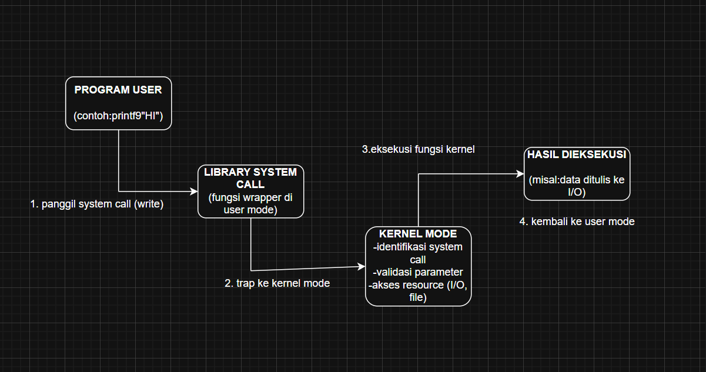
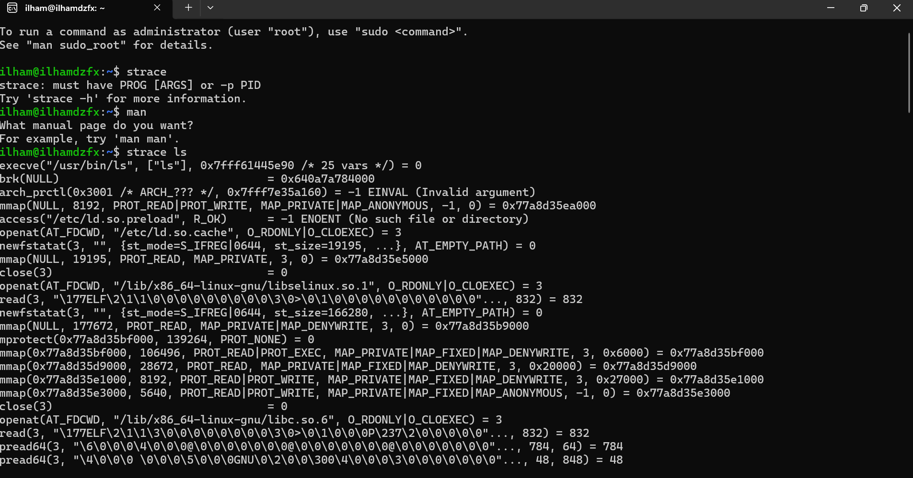

# Laporan Praktikum Minggu [2]
Topik: [Tuliskan judul topik, misalnya "Arsitektur Sistem Operasi dan Kernel"]

---

## Identitas
- **Nama**  : Ilham Dzufikar Barokah
- **NIM**   : 250202942  
- **Kelas** : 1IKRB

---

## Tujuan
Tuliskan tujuan praktikum minggu ini.  
Contoh:  
> Mahasiswa mampu menjelaskan fungsi utama sistem operasi dan peran kernel serta system call.

---

## Dasar Teori
Pada praktikum minggu ini, mahasiswa akan mempelajari mekanisme system call dan struktur sistem operasi.
System call adalah antarmuka antara program aplikasi dan kernel yang memungkinkan aplikasi berinteraksi dengan perangkat keras secara aman melalui layanan OS.

Mahasiswa akan melakukan eksplorasi terhadap:

- Jenis-jenis system call yang umum digunakan (file, process, device, communication).
- Alur eksekusi system call dari mode user menuju mode kernel.
- Cara melihat daftar system call yang aktif di sistem Linux.

---

## Langkah Praktikum
1. **Setup Environment**
   - Gunakan Linux (Ubuntu/WSL).
   - Pastikan perintah `strace` dan `man` sudah terinstal.
   - Konfigurasikan Git (jika belum dilakukan di minggu sebelumnya).

2. **Eksperimen 1 – Analisis System Call**
   Jalankan perintah berikut:
   ```bash
   strace ls
   ```
   > Catat 5–10 system call pertama yang muncul dan jelaskan fungsinya.  
   Simpan hasil analisis ke `results/syscall_ls.txt`.

3. **Eksperimen 2 – Menelusuri System Call File I/O**
   Jalankan:
   ```bash
   strace -e trace=open,read,write,close cat /etc/passwd
   ```
   > Analisis bagaimana file dibuka, dibaca, dan ditutup oleh kernel.

4. **Eksperimen 3 – Mode User vs Kernel**
   Jalankan:
   ```bash
   dmesg | tail -n 10
   ```
   > Amati log kernel yang muncul. Apa bedanya output ini dengan output dari program biasa?

5. **Diagram Alur System Call**
   - Buat diagram yang menggambarkan alur eksekusi system call dari program user hingga kernel dan kembali lagi ke user mode.
   - Gunakan draw.io / mermaid.
   - Simpan di:
     ```
     praktikum/week2-syscall-structure/screenshots/syscall-diagram.png
     ```

6. **Commit & Push**
   ```bash
   git add .
   git commit -m "Minggu 2 - Struktur System Call dan Kernel Interaction"
   git push origin main
   ```


---

## Kode / Perintah
Tuliskan potongan kode atau perintah utama:
```bash
strace ls
strace -e trace=open,read,write,close cat /etc/passwd
dmesg | tail -n 10
```

---

## Hasil Eksekusi
Sertakan screenshot hasil percobaan atau diagram:


.png)
.png)
---
**Eksperimen 1 – Analisis System Call**
# Analisis System Call Hasil strace Perintah `ls`

| No | Perintah / System Call | Fungsi Utama | Output Contoh dari strace | Tujuan / Keterangan |
|----|--------------------------|---------------|----------------------------|---------------------|
| 1 | `execve("/usr/bin/ls", ["ls"], 0x7ffeb16eff70 /* 26 vars */)` | Menjalankan program baru (`ls`) menggantikan proses sebelumnya | `= 0` artinya berhasil | Menjalankan biner `/usr/bin/ls` dengan argumen `["ls"]` dan membawa 26 variabel lingkungan (environment variables). |
| 2 | `brk(NULL)` | Mengatur atau memeriksa posisi akhir segmen heap (memori dinamis) | `= 0x5a90f50d3000` | Mengecek batas awal heap sebelum alokasi memori dinamis dimulai. |
| 3 | `arch_prctl(0x3001, 0x7ffc0334c750)` | Mengatur properti arsitektur CPU untuk proses (biasanya terkait register atau thread local storage) | `= -1 EINVAL (Invalid argument)` | Menunjukkan percobaan pengaturan tertentu gagal karena parameter tidak valid — hal ini normal dalam banyak program. |
| 4 | `mmap(NULL, 8192, PROT_READ\|PROT_WRITE, MAP_PRIVATE\|MAP_ANONYMOUS, -1, 0)` | Memetakan area memori baru (8 KB) untuk digunakan program | `= 0x7f36723df000` | Menyediakan ruang memori anonim yang digunakan untuk struktur internal atau stack kecil. |
| 5 | `access("/etc/ld.so.preload", R_OK)` | Mengecek apakah file `/etc/ld.so.preload` dapat dibaca | `= -1 ENOENT (No such file or directory)` | Mengecek file preload library sistem. Karena file tidak ada, sistem melanjutkan proses tanpa preload. |
| 6 | `openat(AT_FDCWD, "/etc/ld.so.cache", O_RDONLY\|O_CLOEXEC)` | Membuka file cache library dinamis (`ld.so.cache`) | `= 3` (file descriptor 3) | Digunakan untuk mempercepat pencarian library yang diperlukan oleh program. |
| 7 | `newfstatat(3, "", {st_mode=S_IFREG\|0644, st_size=19195, ...}, AT_EMPTY_PATH)` | Mengambil informasi metadata file (status, ukuran, mode, izin) dari file descriptor 3 | `= 0` | Mengecek detail file `/etc/ld.so.cache` seperti ukuran dan hak akses sebelum digunakan lebih lanjut. |

## Eksperimen 2 – Menelusuri System Call File I/O
- Pada hasil strace tersebut, terlihat bahwa kernel melakukan beberapa system call openat() dan read() untuk membuka serta membaca isi file yang diperlukan oleh program. Proses ini menunjukkan bahwa setiap kali program membutuhkan data dari suatu file (misalnya file konfigurasi atau data pengguna), kernel akan membuat file descriptor (biasanya angka seperti 3) untuk mengidentifikasi file tersebut dan mengizinkan program melakukan operasi baca tulis melalui descriptor itu.

- Setelah file berhasil dibuka, kernel memproses permintaan baca menggunakan system call read(), yang bertugas mengambil isi file dari penyimpanan dan menyalurkannya ke ruang memori proses pengguna. Nilai kembalian dari read() (seperti = 1476) menunjukkan jumlah byte yang berhasil dibaca dari file tersebut. Jika kernel mengembalikan nilai 0, artinya proses pembacaan telah mencapai akhir file (EOF), dan tidak ada lagi data yang dapat diambil.

- Setelah operasi pembacaan selesai, program akan menutup file menggunakan system call close(). Pemanggilan close() mengembalikan kontrol penuh kepada kernel untuk melepaskan sumber daya yang digunakan oleh file descriptor tersebut. Nilai keluaran = 0 menandakan bahwa penutupan berhasil dilakukan. Proses penutupan file ini penting agar tidak terjadi kebocoran file descriptor, yang dapat menghabiskan sumber daya sistem jika dibiarkan terbuka terus-menerus.

- Secara keseluruhan, urutan system call seperti openat(), read(), dan close() memperlihatkan bagaimana interaksi antara program dan kernel dalam manajemen berkas berlangsung. Kernel bertanggung jawab membuka akses, mengatur pembacaan data dari media penyimpanan, lalu menutupnya kembali setelah selesai. Hal ini menunjukkan peran penting kernel dalam menjaga keamanan, efisiensi, dan stabilitas sistem operasi saat program berinteraksi dengan file.
## Eksperimen 3 – Mode User vs Kernel

 - Output log kernel berbeda dari output program biasa karena berasal dari inti sistem operasi (kernel), bukan dari aplikasi pengguna. Log kernel menampilkan pesan status, inisialisasi modul, atau error sistem dengan format waktu seperti [6.233638], sedangkan output program biasa menunjukkan hasil perintah atau proses yang dijalankan pengguna. Kernel log digunakan untuk diagnostik dan pemantauan sistem, sementara output program biasa berfungsi untuk interaksi langsung dengan pengguna.
## Analisis
- Jelaskan makna hasil percobaan.  
 Makna hasil percobaan system call adalah membuktikan bahwa semua interaksi antara program pengguna dan sumber daya sistem harus melalui lapisan sistem operasi (kernel) dengan perantara system call, sehingga sistem tetap aman, stabil, dan terkontrol.
- Hubungkan hasil dengan teori (fungsi kernel, system call, arsitektur OS).  
  
  Hubungan hasil dengan teori fungsi kernel Adalah inti dari sistem operasi yang bertanggung jawab atas manajemen proses, memori, file , dan perangkat keras.

   Hubungan hasil dengan teori system Call Adalah antarmuka antara space dan kernel space,mekanisme yang memungkinkan program pengguna meminta layanan dari kernel.

   Hubungan hasil dengan teori Arsitektur Sistem Operasi terdiri dari dua lapisan utama:
  •  User mode (lapisan pengguna) → tempat aplikasi berjalan.

  •  Kernel mode (lapisan inti sistem) → tempat kernel bekerja mengatur sumber daya.

- Apa perbedaan hasil di lingkungan OS berbeda (Linux vs Windows)?  
  
   Percobaan system call di Linux dan Windows memberikan hasil yang berbeda karena kedua sistem menggunakan mekanisme, standar, dan arsitektur kernel yang berbeda.

  Di Linux, system call bersifat terbuka, langsung, dan mudah diamati.

  Di Windows, system call dibungkus dalam API tingkat tinggi dan tidak langsung terlihat oleh pengguna.

**Analisis 400-500 kata**
Analisis Praktikum System Call
Tujuan praktikum system call yaitu perlu memahami bagaimana program pengguna berinteraksi melalui kernel sistem operasi untuk menjalankan berbagai layanan sistem seperti manajemen proses, file, memori, dan perangkat keras. Dalam sistem operasi modern, system call menjadi komponen penting yang berperan sebagai penghubung antara user space dan kernel space. Dengan mekanisme ini, program aplikasi dapat meminta layanan dari sistem operasi tanpa harus memiliki akses langsung ke perangkat keras, yang dapat membahayakan keamanan dan kestabilan sistem.
Pada hasil percobaan, dapat diamati bahwa setiap operasi yang dilakukan oleh program pengguna sebenarnya melibatkan pemanggilan system call. Misalnya, ketika program membaca atau menulis file, proses tersebut akan melewati system call seperti read() dan write(). Begitu pula saat program membuat proses baru menggunakan fork() atau mengeksekusi program lain dengan exec(). Semua perintah tersebut tidak dijalankan secara langsung oleh aplikasi, tetapi diteruskan ke kernel melalui mekanisme software interrupt.
Hasil praktikum juga memperlihatkan bahwa terdapat perbedaan mendasar antara user mode dan kernel mode. User mode membatasi akses program terhadap sumber daya sistem untuk mencegah kesalahan fatal, sedangkan kernel mode memiliki hak akses penuh terhadap seluruh perangkat keras dan memori. Ketika sebuah system call dipanggil, eksekusi berpindah dari user mode ke kernel mode untuk menjalankan operasi tertentu, kemudian kembali lagi ke user mode setelah tugas selesai. Proses ini membuktikan pentingnya lapisan keamanan dan pengendalian dalam arsitektur sistem operasi.
Selain itu, dari hasil perbandingan pada dua sistem operasi berbeda, yaitu Linux dan Windows, terlihat adanya perbedaan dalam cara system call diimplementasikan. Linux menggunakan standar POSIX yang terbuka dan memungkinkan pengguna untuk mengamati system call secara langsung menggunakan alat seperti strace. Sementara itu, Windows menggunakan pendekatan tertutup melalui Windows API dan Native API, di mana pemanggilan system call tidak dapat diamati secara langsung karena dibungkus oleh pustaka tingkat tinggi. Perbedaan masing-masing sistem: Linux yang transparan dan fleksibel, sedangkan Windows lebih berorientasi pada keamanan dan kompatibilitas aplikasi.
Secara keseluruhan, praktikum ini memperkuat pemahaman bahwa system call merupakan fondasi penting dalam interaksi antara perangkat lunak dan sistem operasi. Melalui mekanisme ini, kernel dapat memastikan bahwa setiap permintaan sumber daya dilakukan dengan cara yang aman, efisien, dan terkendali. Dengan memahami konsep dan perilaku system call, mahasiswa dapat lebih memahami peran sistem operasi dalam menjaga kestabilan dan keamanan sistem komputer secara keseluruhan.


---

## Kesimpulan
Praktikum ini menunjukkan bahwa system call merupakan mekanisme inti yang memungkinkan komunikasi aman antara program pengguna dan kernel dalam arsitektur sistem operasi.
Melalui system call, sistem operasi dapat menjalankan fungsi-fungsi pentingnya secara terkendali, efisien, dan aman di berbagai platform (Linux maupun Windows).

---

## Quiz
1. Apa fungsi utama system call dalam sistem operasi?  
   **Jawaban:** Fungsi utama system call adalah memberikan antarmuka yang aman bagi program pengguna untuk menggunakan layanan dan sumber daya sistem operasi.  
2. Sebutkan 4 kategori system call yang umum digunakan.  
   **Jawaban:**   File Management (Manajemen Berkas)
→ Digunakan untuk mengelola file, seperti:
o	create(), open(), read(), write(), close(), delete()

   Process Control (Pengendalian Proses)
   → Digunakan untuk membuat, menjalankan, atau menghentikan proses.
o	fork(), exec(), exit(), wait(), kill()

   Memory Management (Manajemen Memori)
   → Digunakan untuk mengatur alokasi dan dealokasi memori.
o	brk(), mmap(), malloc() (melalui library yang memanggil system call di bawahnya)

	Device Management / I/O (Manajemen Perangkat/Input-Output)
→ Digunakan untuk berinteraksi dengan perangkat keras melalui driver.
o	read(), write(), ioctl(), open(), close()

3. Mengapa system call tidak bisa dipanggil langsung oleh user program?  
   **Jawaban:**  Karena hanya kernel yang memiliki hak untuk mengakses sumber daya sistem secara langsung, sehingga semua permintaan harus melalui mekanisme yang aman (trap/interrupt).

---

## Refleksi Diri
Tuliskan secara singkat:
- Apa bagian yang paling menantang minggu ini?  
  selalu menantang
- Bagaimana cara Anda mengatasinya? 
 
  belajar bersama teman dan melihat tutorial

---

**Credit:**  
_Template laporan praktikum Sistem Operasi (SO-202501) – Universitas Putra Bangsa_
